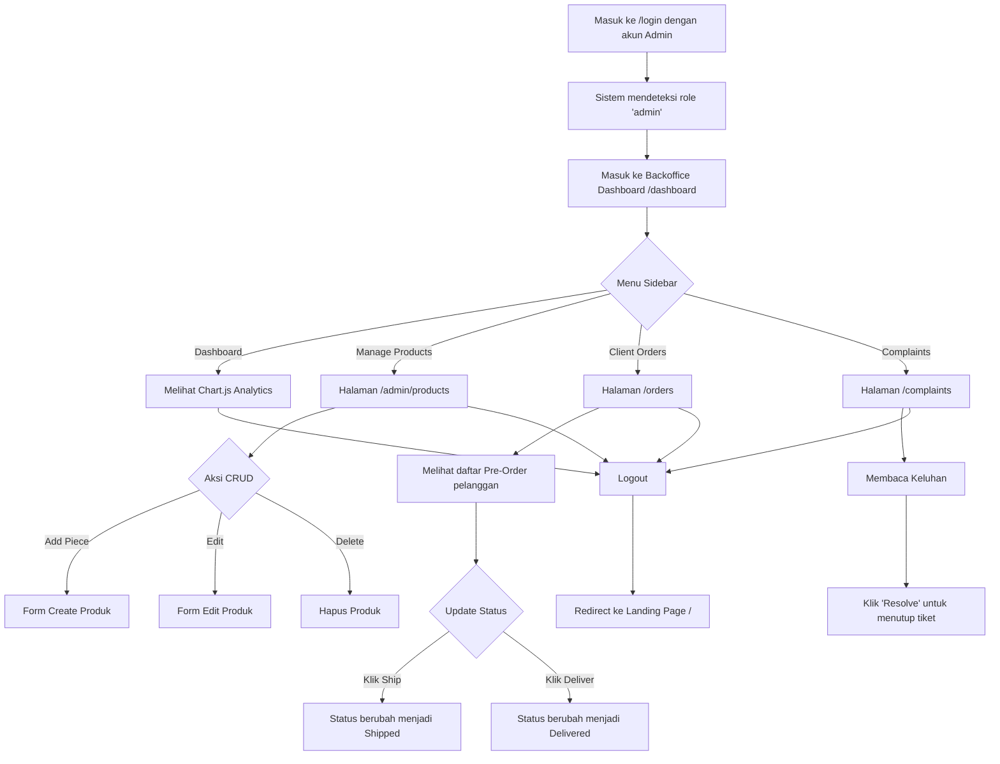

# System Flowchart & User Journey
## A'ritza - Luxury Fashion E-Commerce

Berikut adalah alur navigasi dari kedua sisi pengguna (Buyer & Admin) di dalam ekosistem A'ritza.

### 1. Buyer / Guest Flow (Customer Journey)

```mermaid
flowchart TD
    A[Masuk ke Landing Page /] --> B{Pilih Aksi?}
    B -->|Melihat Koleksi| C[Halaman Katalog /products]
    B -->|Pencarian/Filter| D[Filter /products?search=...]
    C --> E{Klik Tombol Pre-Order}
    D --> E
    
    E --> F{Sudah Login?}
    F -->|Belum| G[Halaman /login]
    G -->|Berhasil| H[Redirect ke Halaman Sebelumnya / Katalog]
    H --> E
    
    F -->|Sudah| I[Sistem memproses Pre-Order (POST /orders)]
    I --> J[Halaman /my-purchases]
    J --> K[Pelanggan dapat memantau status pesanan]
    
    J --> L{Selesai Belanja?}
    L -->|Logout| M[Redirect ke Landing Page /]
```

### 2. Administrator Flow (Backoffice Journey)


